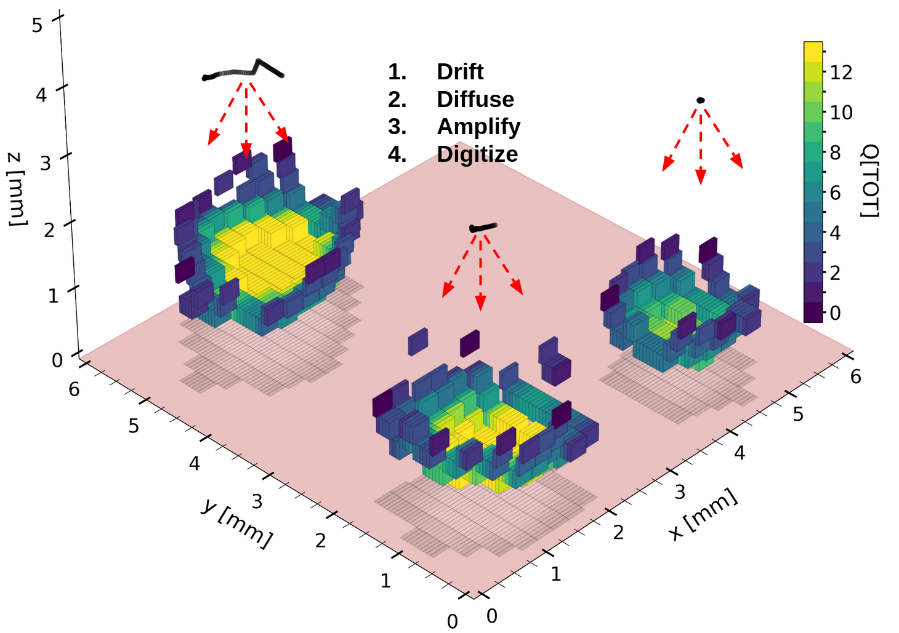

# BEAST_TPC_Fast_Digitizer

**Note: [ROOT](https://root.cern/install/) is required to run digitize.py and root_pandas (a deprecated package) is required to run produce_primary_tracks.py for electron recoil samples produced in Degrad. Instructions for setting up an environment compatible for running all modules follows below the description of the package.**

## Decription
This package contains tools to simulate recoil events in a BEAST TPC. The module assumes the user has already simulated primary recoil tracks using software like [Degrad](https://degrad.web.cern.ch/degrad/) or [SRIM](http://www.srim.org/). **`produce_primary_tracks.py`** will read in these primary recoil tracks and process them into a pandas dataframe to be read into **`digitize.py`**. **`produce_primary_tracks.py`** also has functionality to rotate the primary tracks (following an isotropic angular distribution) to augment event-image sets that may be used for training machine learning classifiers on recoil events.

**`digitize.py`** is the bread and butter of this package. **`digitize.py`** reads in primary tracks and simulates (1) the drifting of charge in a TPC's electric field, (2) the diffusion due to the drift, (3) the amplification of charge, (4) additional diffusion through the amplification device (GEM, micromegas, etc.), (5) [optional] the noise floor of a pixel readout, and (6) the digitization (quantization) of charge into voxels. 
**`digitize.py`** also processes the digitized events with several features that are useful both for statistical and event-level analyses of recoils.

## Installation

I recommend using [Anaconda](https://www.anaconda.com/) to install the appropriate packages. **Highly recommended**: create a separate environment when using this digitizer so that package dependencies don't interfere with your usual working environment(s).

### Optional but recommended (Note: python 3.6 is required for root_pandas!)
`conda create -n digitizer_env python=3.6 root -c conda-forge` (Installs root while you create the new environment, which seems to be the best way to do it)
`conda activate digitizer_env`

### Required packages
`conda install -c conda-forge root` (**Not needed if you followed the optional but recommended steps above!**)

`conda install pandas`

`conda install -c conda-forge root_pandas`

`conda install numba`

`conda install tqdm`

`conda install hdf5`

`conda install h5py` 

`pip3 install hdf5plugin`

`pip3 install tables`

`conda install matplotlib-base`

`pip3 install pyarrow` (pyarrow needed to read and write `.feather` files with pandas)

`conda install scipy`

After installing these packages, you should be able to run **`digitize.py`**. Test files are included in this package, so out of the box, you may test **`python3 digitize.py 1000`**, which will create the following file: `data/digitized/testFileDigitized_gain1000.feather`. You can open these files using [pandas' read_feather function](https://pandas.pydata.org/docs/reference/api/pandas.read_feather.html).
